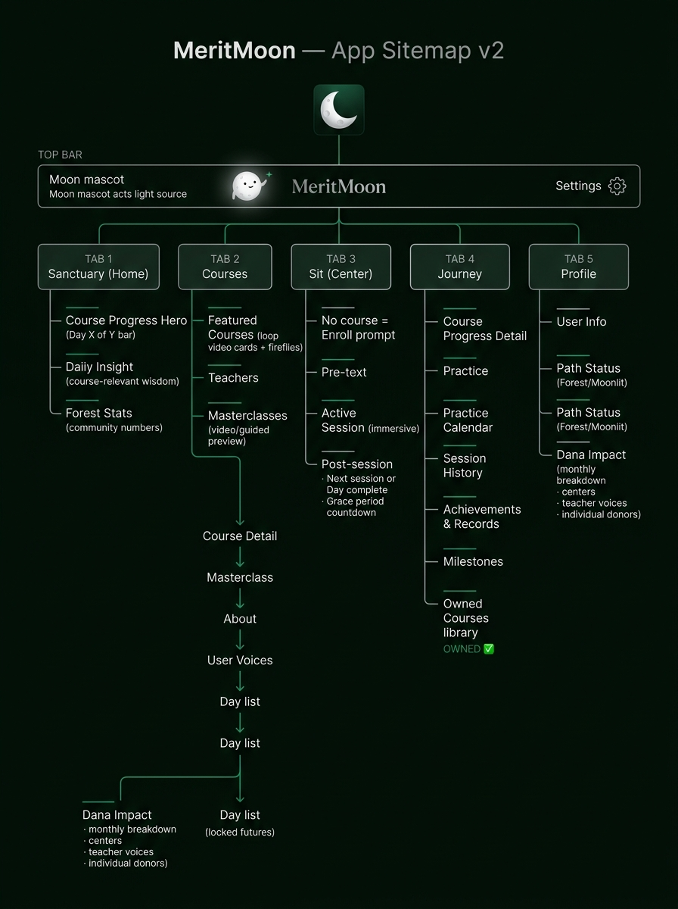
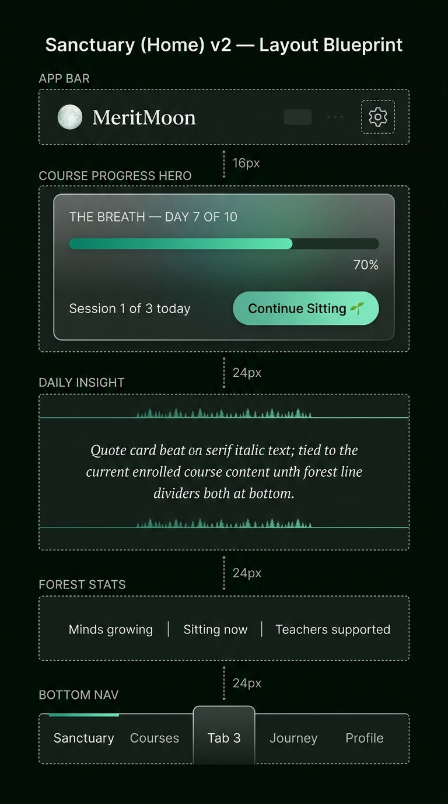
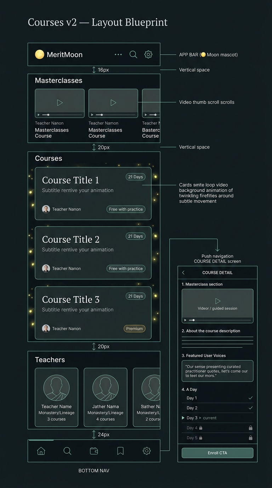
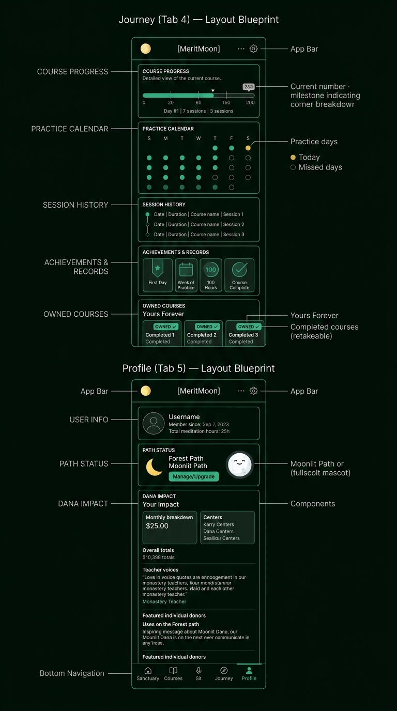
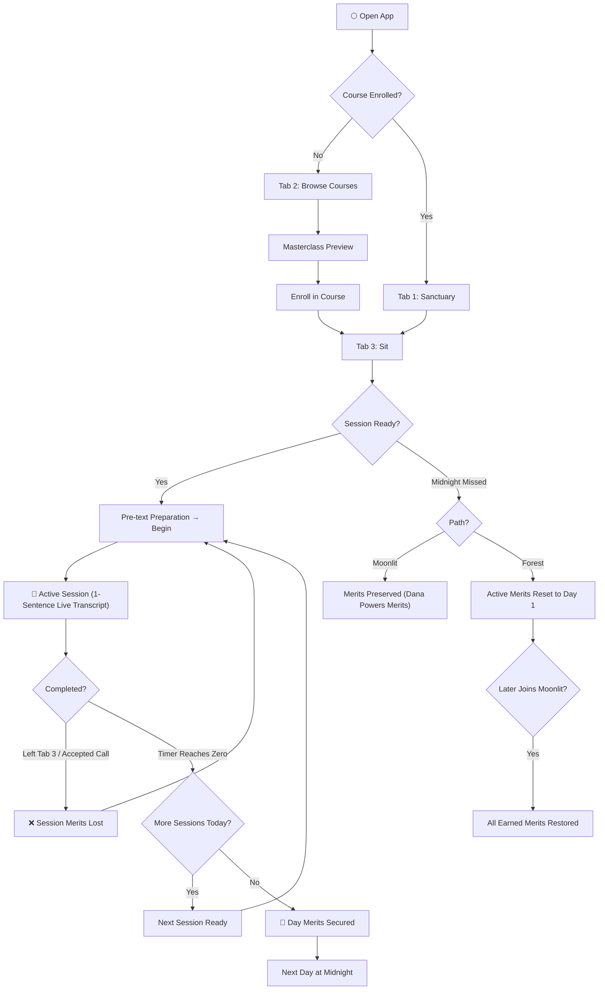

# 🏗️ MeritMoon Mobile — Content Architecture & Layout

> How every screen is structured, what content lives where, and how practitioners flow through the app.
> For sacred vocabulary and Burmese terms, see [`vocabulary.md`](./vocabulary.md).
> For full product rules and mechanics, see [`product-spec.md`](./product-spec.md).
> For visual design tokens, see [`design.md`](./design.md).
> For mascot blueprints and animation models, see [`mascot-guidelines.md`](./mascot-guidelines.md).

---

## 🗺️ App Sitemap



### Navigation Structure

```
🌕 MeritMoon App
│
├── [Top Bar]  🌕 Moon mascot (light source) + wordmark ............. ⚙️ Settings
│
├── Tab 1: Sanctuary (Home)
│   ├── Course Merits Hero (Day X of Y Merits bar + session status)
│   ├── Daily Insight (course-relevant wisdom reflection)
│   └── Forest Stats (community numbers: minds growing, sitting now, teachers supported)
│
├── Tab 2: Courses
│   ├── Masterclass Highlights (preview video / guided session cards)
│   ├── Featured Courses (subtle loop video cards + fireflies)
│   ├── Teachers (lineages & profiles synced alongside courses)
│   └── Course Detail (push nav)
│       ├── Masterclass (video / guided preview)
│       ├── About
│       ├── Featured User Voices (curated text reflections from practitioners)
│       └── Day List (future days: 🔒 no titles to preserve discovery)
│
├── Tab 3: Sit (Elevated Center Tab)
│   ├── No Course Enrolled → Prompt to enroll
│   ├── Session Available → Pre-text preparation → "Begin Session" CTA
│   ├── Active Session → Full-screen immersive (Moon timer, live 1-sentence transcript)
│   ├── Session Complete (more today) → Congratulations → Session 2 of N ready
│   ├── Day Merits Complete → Congratulations + mindful reflection recommendation
│   └── Waiting for Next Day → Midnight countdown
│
├── Tab 4: Journey
│   ├── Course Merits Detail (progress meter with milestone markers)
│   ├── Practice Calendar (monthly grid: emerald ● = completed, gold ● = today, empty ○ = missed)
│   ├── Session History (chronological practice timeline)
│   ├── Lifetime Accomplishments & Records (milestones, total sitting hours)
│   └── Owned Courses (OWNED ✓, freely re-listenable, option to restart & earn again merits)
│
└── Tab 5: Profile
    ├── Practitioner Info (avatar, username, member since, total hours)
    ├── Path Status (Forest / Moonlit badge + management)
    └── Dana Impact (monthly/cumulative totals, center profiles, teacher voices, individual donors)
```

> [!NOTE]
> **No streak counter** exists in MeritMoon. Motivation is rooted in genuine practice discipline and the sacred value of earning and protecting course merits.

---

## 🧩 Content Types

| #   | Type                     | Where                 | Key Elements                                                              |
| :-- | :----------------------- | :-------------------- | :------------------------------------------------------------------------ |
| 1   | **Course Merits Hero**   | Home                  | Day X of Y Merits bar, today's session status, CTA                        |
| 2   | **Course Card**          | Courses, Home         | Loop video background, floating fireflies, title, teacher, duration, tags |
| 3   | **Masterclass Card**     | Courses               | Video preview / guided session taste, teacher, course link                |
| 4   | **Teacher Card**         | Courses               | Photo, name, monastery / lineage, courses taught                          |
| 5   | **Session Card**         | Sit tab               | Pre-text preparation, session index, duration, Begin CTA                  |
| 6   | **Daily Insight**        | Home                  | Course-relevant wisdom reflection. General if unenrolled                  |
| 7   | **User Voice Card**      | Course detail         | Curated practitioner text reflection for a specific day                   |
| 8   | **Dana Impact Card**     | Profile               | Monthly/overall stats, center directory, teacher voices                   |
| 9   | **Path Status Card**     | Profile               | Forest / Moonlit badge, upgrade / manage CTA                              |
| 10  | **Milestone Card**       | Journey, Post-session | Milestone icon, title, description, earned date                           |
| 11  | **Wisdom Quote Card**    | Home, Post-session    | Serif quote, attribution, forest divider accents                          |
| 12  | **Forest Stats Bar**     | Home                  | 3-column community numbers                                                |
| 13  | **Owned Course Card**    | Journey               | OWNED ✓ badge, re-listen access, restart CTA                              |
| 14  | **Accomplishment Badge** | Journey               | Practice milestones: First Day, 100 Hours, Course Complete                |

---

## 📐 Screen Layouts

### Tab 1: Sanctuary (Home)



| Zone                   | Content                                                                                          | Spacing  |
| :--------------------- | :----------------------------------------------------------------------------------------------- | :------- |
| **App Bar**            | 🌕 Moon mascot (38px, canonical light source) + wordmark + ⚙️ Settings                           | sticky   |
| **Course Merits Hero** | Full course bar (Day X of Y Merits), today's session status, CTA. No course = enrollment prompt. | `↕ 16px` |
| **Daily Insight**      | Course-relevant wisdom card (Cormorant Garamond italic serif, forest dividers)                   | `↕ 24px` |
| **Forest Stats**       | 3-column community metrics: Minds growing · Sitting now · Teachers supported                     | `↕ 24px` |
| **Bottom Nav**         | 5 tabs, Sit (center) elevated with gold moon accent                                              | fixed    |

---

### Tab 2: Courses



| Zone                 | Content                                                                         | Spacing  |
| :------------------- | :------------------------------------------------------------------------------ | :------- |
| **App Bar**          | 🌕 Moon mascot + wordmark + search + ⚙️                                         | sticky   |
| **Masterclasses**    | Horizontal carousel of preview cards (video thumb + teacher + title)            | `↕ 16px` |
| **Featured Courses** | Vertical list — loop video cards with fireflies, teacher avatar, duration badge | `↕ 20px` |
| **Teachers**         | Horizontal carousel — teacher photo, name, monastery, course count              | `↕ 20px` |
| **Bottom Nav**       | 5 tabs                                                                          | fixed    |

**Course Detail (Push Navigation):**

1. Masterclass (video player / introductory guided session)
2. About the course & lineage
3. Featured User Voices (curated text comments from practitioners)
4. Day list: Day 1 ✓, Day 2 ✓, Day 3 ▶ current, Day 4 🔒, Day 5 🔒 (locked days hide titles)
5. Enroll CTA

---

### Tab 3: Sit (Elevated Center Tab)

| State                         | Screen Experience                                                                                                                                                         |
| :---------------------------- | :------------------------------------------------------------------------------------------------------------------------------------------------------------------------ |
| **No Course**                 | "Your journey begins with a course" → Browse Courses CTA                                                                                                                  |
| **Pre-Session**               | Pre-text card (posture, terminology, environment setup) → "Begin Session" CTA                                                                                             |
| **Active Session**            | Full-screen immersive: moon mascot with breathing ring + countdown timer + **live 1-sentence transcript (word-by-word reveal)** + 10s rewind. **No navigation possible.** |
| **Session Done (More Today)** | Congrats → "Session 2 of 3 ready"                                                                                                                                         |
| **Day Merits Complete**       | 🎉 Day complete → practice recommendation → next day unlocks at midnight                                                                                                  |
| **Waiting**                   | Countdown timer to midnight unlock                                                                                                                                        |

---

### Tab 4: Journey & Tab 5: Profile



#### Journey (Tab 4)

| Zone                  | Content                                                                                      |
| :-------------------- | :------------------------------------------------------------------------------------------- |
| **Course Merits**     | Detailed progress bar with milestone markers, day number, and session status                 |
| **Practice Calendar** | Monthly grid: emerald ● = completed, gold ● = today, empty ○ = missed                        |
| **Session History**   | Chronological timeline: date, duration, course name, session index                           |
| **Lifetime Records**  | Milestone badges, total meditation hours, completed courses                                  |
| **Owned Courses**     | Library of OWNED ✓ courses — freely re-listenable, or choose to restart to earn again merits |

#### Profile (Tab 5)

| Zone            | Content                                                                              |
| :-------------- | :----------------------------------------------------------------------------------- |
| **User Info**   | Avatar, username, member since, cumulative sitting hours                             |
| **Path Status** | Forest (🌙) / Moonlit (🌕) badge, subscription management                            |
| **Dana Impact** | Monthly & lifetime breakdown, monastery directory, teacher voices, individual donors |

---

## 🔄 Practitioner Flow


