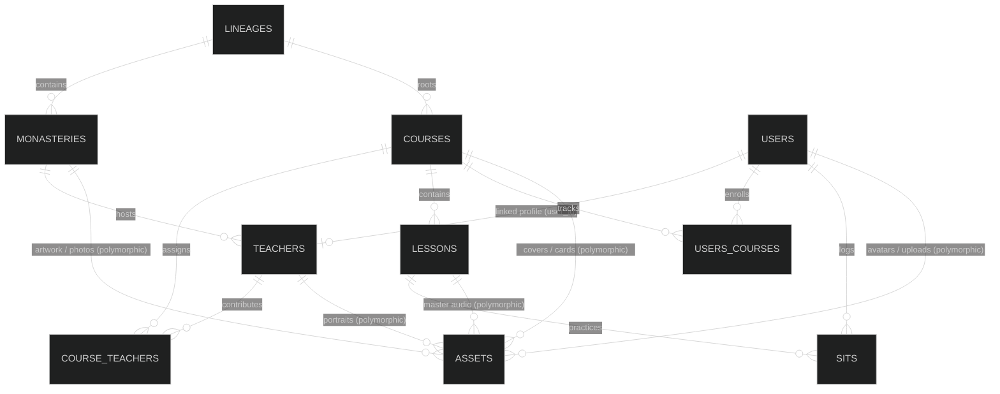

# 🗄️ MeritMoon Database Schema Specification

This document defines the complete database architecture for **MeritMoon**, structured on top of the **Rexone Core** Rails API.

---

## 📐 Entity Relationship Diagram

---

## 🏛️ Database Tables & Schema

### 1. Traditions & Monasteries

#### `lineages` (Meditation Lineages / Traditions)

_Stores historical and doctrinal meditation traditions (e.g., Pa-Auk, The-Inn-Gu, Yay-Soon, Myay-Zin, Mahasi, Mogok)._

| Column        | Type      | Constraints                               | Description                            |
| :------------ | :-------- | :---------------------------------------- | :------------------------------------- |
| `id`          | `UUID`    | Primary Key, `default: gen_random_uuid()` | Unique record ID                       |
| `name`        | `string`  | `null: false`                             | Lineage name                           |
| `description` | `text`    | `null: true`                              | Detailed historical lineage overview   |
| `origin`      | `string`  | `null: true`                              | Country / Region of origin (e.g. `mm`) |
| `position`    | `integer` | `null: false`, `default: 1`               | Display order in lists                 |

---

#### `monasteries` (Meditation Centers & Monasteries)

_Stores meditation centers and monasteries. One lineage can have many monasteries, but a monastery does not strictly require a lineage._

| Column        | Type        | Constraints                               | Description                                               |
| :------------ | :---------- | :---------------------------------------- | :-------------------------------------------------------- |
| `id`          | `UUID`      | Primary Key, `default: gen_random_uuid()` | Unique record ID                                          |
| `lineage_id`  | `UUID`      | `null: true`, `foreign_key: true`         | Associated lineage                                        |
| `name`        | `string`    | `null: false`                             | Monastery / Center name                                   |
| `country`     | `string(2)` | `null: true`, `index: true`               | ISO 3166-1 alpha-2 lowercase code (e.g. `mm`, `us`, `th`) |
| `city`        | `string`    | `null: true`                              | City / Division / State                                   |
| `latitude`    | `decimal`   | `precision: 10, scale: 7`, `null: true`   | Geographic coordinate for map routing                     |
| `longitude`   | `decimal`   | `precision: 10, scale: 7`, `null: true`   | Geographic coordinate for map routing                     |
| `description` | `text`      | `null: true`                              | Monastery history and practice facilities                 |

> **Media**: Photos, card art, and video tours are linked via the polymorphic `assets` table (`resource_model: "monastery"`, `resource_id: id`, `type: "cover"` / `"card"` / `"gallery"`).

---

### 2. Teachers & Faculty

#### `teachers` (Meditation Masters, Sayadaws & Teachers)

_Stores teacher profiles. Teachers are linked to `users` table via `user_id`. When created by an admin, `user_id` is initially null until the teacher registers and is pointed to their profile._

| Column         | Type     | Constraints                                       | Description                                                      |
| :------------- | :------- | :------------------------------------------------ | :--------------------------------------------------------------- |
| `id`           | `UUID`   | Primary Key, `default: gen_random_uuid()`         | Unique record ID                                                 |
| `user_id`      | `UUID`   | `null: true`, `foreign_key: true`, `unique: true` | Linked authentication user account                               |
| `monastery_id` | `UUID`   | `null: true`, `foreign_key: true`                 | Primary affiliated monastery                                     |
| `name`         | `string` | `null: false`                                     | Full name or Venerable title                                     |
| `title`        | `string` | `null: true`                                      | Honorific / title (e.g., _Sayadaw_, _Senior Meditation Teacher_) |
| `bio`          | `text`   | `null: true`                                      | Biography and teaching background                                |

> **Media**: Profile portraits and avatars are linked via `assets` (`resource_model: "teacher"`, `resource_id: id`, `type: "avatar"`).

---

### 3. Courses & Practice Sessions

#### `courses` (Meditation Journeys & Curricula)

_Stores structured meditation curricula._

| Column                  | Type      | Constraints                                  | Description                                                              |
| :---------------------- | :-------- | :------------------------------------------- | :----------------------------------------------------------------------- |
| `id`                    | `UUID`    | Primary Key, `default: gen_random_uuid()`    | Unique record ID                                                         |
| `lineage_id`            | `UUID`    | `null: true`, `foreign_key: true`            | Associated lineage                                                       |
| `title`                 | `string`  | `null: false`                                | Course title                                                             |
| `slug`                  | `string`  | `null: false`, `unique: true`, `index: true` | URL-safe identifier (e.g. `paauk-anapana-foundations`)                   |
| `subtitle`              | `string`  | `null: true`                                 | One-sentence summary hook                                                |
| `summary`               | `text`    | `null: true`                                 | Short overview description                                               |
| `description`           | `text`    | `null: true`                                 | In-depth syllabus and practice explanation                               |
| `tier`                  | `integer` | `null: false`, `default: 0`                  | Enum: `0: free`, `1: moonlit` (Moonlit grants 100% all-inclusive access) |
| `temperament`           | `integer` | `null: false`, `default: 0`                  | Character disposition enum (see reference below)                         |
| `days`                  | `integer` | `null: false`, `default: 1`                  | Number of days spanning the course                                       |
| `published`             | `boolean` | `null: false`, `default: false`              | Only `true` when all child lessons are published                         |
| `position`              | `integer` | `null: false`, `default: 1`                  | Default catalog ordering                                                 |
| `lessons_count`         | `integer` | `null: false`, `default: 0`                  | _⚡ Denormalized_: Total lessons inside                                  |
| `duration_secs`         | `integer` | `null: false`, `default: 0`                  | _⚡ Denormalized_: Total practice duration in seconds                    |
| `enrolled_users_count`  | `integer` | `null: false`, `default: 0`                  | _⚡ Denormalized_: Number of users who started course                    |
| `completed_users_count` | `integer` | `null: false`, `default: 0`                  | _⚡ Denormalized_: Number of users who completed all lessons             |

> **Temperament (_Carita_) Enum Reference**:
>
> - `0: anger_calming` (_Dosa-carita_ $\rightarrow$ Metta, patience, goodwill)
> - `1: greed_subduing` (_Rāga-carita_ $\rightarrow$ Asubha, body contemplation)
> - `2: restlessness_stilling` (_Vitakka-carita_ $\rightarrow$ Anapana, single-pointed concentration)
> - `3: confusion_clearing` (_Moha-carita_ $\rightarrow$ Clear comprehension, grounding)
> - `4: sloth_awakening` (_Thīna-middha_ $\rightarrow$ Light perception, walking meditation, energy)
> - `5: wisdom_inquiry` (_Buddhi-carita_ $\rightarrow$ Dhatu, 4 elements, Vipassana insight)
> - `6: faith_devotion` (_Saddhā-carita_ $\rightarrow$ Buddha recollections, peace)

---

#### `course_teachers` (Rich Join: Courses $\leftrightarrow$ Teachers)

_Connects teachers to courses with distinct pedagogical roles and ordering._

| Column       | Type      | Constraints                               | Description                                                                            |
| :----------- | :-------- | :---------------------------------------- | :------------------------------------------------------------------------------------- |
| `id`         | `UUID`    | Primary Key, `default: gen_random_uuid()` | Unique record ID                                                                       |
| `course_id`  | `UUID`    | `null: false`, `foreign_key: true`        | Course record                                                                          |
| `teacher_id` | `UUID`    | `null: false`, `foreign_key: true`        | Teacher record                                                                         |
| `role`       | `integer` | `null: false`, `default: 0`               | Enum: `0: main_teacher`, `1: assistant_teacher`, `2: translator`, `3: chanting_master` |
| `position`   | `integer` | `null: false`, `default: 1`               | Display order among instructors                                                        |

_Index: Unique index on `[course_id, teacher_id]`._

---

#### `lessons` (Meditation Sittings & Exercises)

_Stores individual guided audio sittings within a course._

| Column          | Type      | Constraints                               | Description                                                                           |
| :-------------- | :-------- | :---------------------------------------- | :------------------------------------------------------------------------------------ |
| `id`            | `UUID`    | Primary Key, `default: gen_random_uuid()` | Unique record ID                                                                      |
| `course_id`     | `UUID`    | `null: false`, `foreign_key: true`        | Associated course                                                                     |
| `title`         | `string`  | `null: false`                             | Sitting title (e.g., _Awakening the Breath Anchor_)                                   |
| `day`           | `integer` | `null: false`, `default: 1`               | Day number (e.g. Day 1, Day 2...)                                                     |
| `position`      | `integer` | `null: false`, `default: 1`               | Sitting position within that day (e.g. 1 = Morning, 2 = Evening)                      |
| `duration_secs` | `integer` | `null: false`                             | Exact audio duration in seconds                                                       |
| `instructions`  | `jsonb`   | `null: false`, `default: []`              | Bullet points array: `["Sit comfortably", "Anchor at nostrils", "Note distractions"]` |
| `published`     | `boolean` | `null: false`, `default: true`            | Published state                                                                       |

_Index: Unique index on `[course_id, day, position]`._

> **Audio Asset**: Master audio streams are linked via `assets` (`resource_model: "lesson"`, `resource_id: id`, `type: "audio"`, `duration: duration_secs`).

---

### 4. Practitioner Progress & Sitting History

#### `user_courses` (User Course Enrollment & Progress)

_Tracks user enrollment and completion in courses._

| Column              | Type       | Constraints                               | Description                                                                        |
| :------------------ | :--------- | :---------------------------------------- | :--------------------------------------------------------------------------------- |
| `id`                | `UUID`     | Primary Key, `default: gen_random_uuid()` | Unique record ID                                                                   |
| `user_id`           | `UUID`     | `null: false`, `foreign_key: true`        | Practitioner user                                                                  |
| `course_id`         | `UUID`     | `null: false`, `foreign_key: true`        | Enrolled course                                                                    |
| `status`            | `integer`  | `null: false`, `default: 0`               | Enum: `0: active`, `1: completed`                                                  |
| `completed_lessons` | `jsonb`    | `null: false`, `default: []`              | Array of completed maps: `[{"lesson_id": "...", "day": 1, "completed_at": "..."}]` |
| `created_at`        | `datetime` | `null: false`                             | Timestamp when user started course                                                 |
| `completed_at`      | `datetime` | `null: true`                              | Timestamp when all lessons completed                                               |

_Index: Unique index on `[user_id, course_id]`._

---

#### `sits` (Meditation Session Log & Personal Journal)

_Records every meditation session completed by the practitioner._

| Column          | Type       | Constraints                               | Description                                                                                          |
| :-------------- | :--------- | :---------------------------------------- | :--------------------------------------------------------------------------------------------------- |
| `id`            | `UUID`     | Primary Key, `default: gen_random_uuid()` | Unique record ID                                                                                     |
| `user_id`       | `UUID`     | `null: false`, `foreign_key: true`        | Practitioner user                                                                                    |
| `course_id`     | `UUID`     | `null: false`, `foreign_key: true`        | Course practiced                                                                                     |
| `lesson_id`     | `UUID`     | `null: false`, `foreign_key: true`        | Lesson / exercise practiced                                                                          |
| `duration_secs` | `integer`  | `null: false`                             | Time sat in seconds                                                                                  |
| `mood`          | `integer`  | `null: true`                              | Enum: `0: peaceful`, `1: calm`, `2: balanced`, `3: restless`, `4: sleepy`, `5: agitated`, `6: clear` |
| `notes`         | `text`     | `null: true`                              | Private personal journal reflection                                                                  |
| `completed_at`  | `datetime` | `null: false`                             | Timestamp when sitting was completed                                                                 |
| `created_at`    | `datetime` | `null: false`                             | Record timestamp                                                                                     |

---

### 5. Contemplations

#### `quotes` (Daily Dhamma Reflections)

_Stores daily wisdom cards displayed on the Sanctuary home screen._

| Column    | Type     | Constraints                               | Description                  |
| :-------- | :------- | :---------------------------------------- | :--------------------------- |
| `id`      | `UUID`   | Primary Key, `default: gen_random_uuid()` | Unique record ID             |
| `content` | `text`   | `null: false`                             | Quote text                   |
| `author`  | `string` | `null: false`                             | Teacher / Venerable name     |
| `source`  | `string` | `null: true`                              | Sutta or Discourse reference |

---

### 6. Universal Assets Engine (`assets` from Rexone Core)

_All audio, video, photo, card artwork, and document files are stored polymorphically in `assets`._

| Column           | Type      | Constraints                               | Description                                                                         |
| :--------------- | :-------- | :---------------------------------------- | :---------------------------------------------------------------------------------- |
| `id`             | `UUID`    | Primary Key, `default: gen_random_uuid()` | Unique asset ID                                                                     |
| `storage_key`    | `string`  | `null: true`                              | Object key / identifier in object storage (Garage / S3 / R2 / Cloudinary)           |
| `name`           | `string`  | `null: false`                             | Filename or identifier                                                              |
| `url`            | `string`  | `null: false`, `unique: true`             | Public CDN URL                                                                      |
| `type`           | `string`  | `null: false`, `default: "general"`       | Broad type: `avatar`, `cover`, `card`, `audio`, `video`, `attachment`, `general`    |
| `format`         | `string`  | `null: true`                              | Media classification: `image`, `audio`, `video`, `doc` (or `null` if unclassified)  |
| `extension`      | `string`  | `null: true`                              | File extension (e.g. `mp3`, `jpg`, `png`, or `null`)                                |
| `size_bytes`     | `bigint`  | `null: true`                              | Exact file size in bytes                                                            |
| `duration_secs`  | `integer` | `null: true`                              | Duration in seconds (for audio / video, or `null`)                                  |
| `source`         | `string`  | `null: false`, `default: "upload"`        | Origin: `upload`, `google`, etc.                                                    |
| `resource_model` | `string`  | `null: true`, `index: true`               | Lowercase model name: `user`, `course`, `lesson`, `monastery`, `teacher`, `message` |
| `resource_id`    | `UUID`    | `null: true`, `index: true`               | ID of the parent record                                                             |

_Index: Composite index on `[resource_model, resource_id]`._

---
