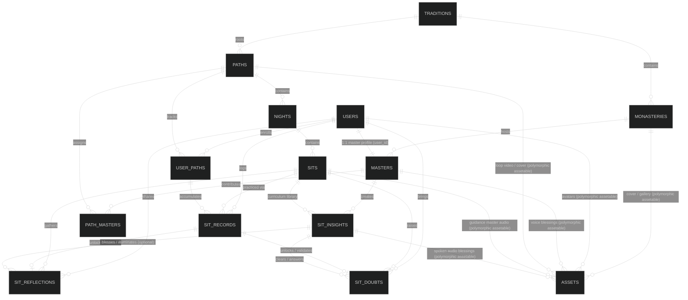

# 🗄️ MeritMoon Database Schema Specification

This document defines the complete database architecture for **MeritMoon**, structured strictly on top of the **RexOne Core** Rails API foundation.

---

## 🏛️ Architectural Standards & RexOne Alignment

All core business models inherit from [`ApplicationRecord`](file:///Users/rex/Desktop/Dev/rexone/rexone-core/app/models/application_record.rb):

```ruby
class ApplicationRecord < ActiveRecord::Base
  primary_abstract_class
  include Discard::Model
  include Auditable

  default_scope -> { kept }
end
```

### Global Model Standards

1. **Primary Key**: UUID v4 default `gen_random_uuid()`.
2. **Soft Deletion (`Discard::Model`)**:
   - `discarded_at` timestamp: Record is hidden by default via `default_scope -> { kept }`.
   - Restored via `undiscard` (`ADMIN_ACTIONS.UNDISCARD`).
3. **Auditing (`Auditable` Concern)**:
   - Tracks actor via `Current.auditor`: `created_by_id`, `updated_by_id`, `discarded_by_id`, `undiscarded_by_id`.
   - Timestamps: `created_at`, `updated_at`, `discarded_at`, `undiscarded_at`.
4. **Timezone Rule & Fixed 4:00 AM Dawn Cutoff (Iron Cross)**:
   - **Server strictly processes and stores UTC** (`Time.current.utc`, `created_at` in UTC).
   - **Meditator's active path is anchored to their enrollment timezone** (`user_paths.timezone`).
   - Cutoff is fixed at **4:00 AM dawn local time** (`dawn: "04:00"`). Non-customizable.
   - If the meditator travels, the active path remains anchored to the enrollment timezone's 4:00 AM.
5. **Zero Loose Code & Database Cleanliness (Law U14)**:
   - No redundant status columns. In `sit_doubts`, pending vs. answered is derived purely from `sit_insight_id.nil?`.
   - Complete wipeout of legacy shims: masters domain uses `masters`, `path_masters`, `master_id`. Zero "teacher" aliases.
6. **Universal Asset Engine (Law U3)**:
   - Zero raw URL columns in domain tables. All media polymorphic via `assetable_type` and `assetable_id` with `storage_key`.
7. **Universal Pagy Pagination (Law U8)**:
   - All collection endpoints return standardized `data` + `meta.pagination`.
8. **Agile Standard Migrations & Model Validations Doctrine (LAW C6)**:
   - **Clean Standard Migrations**: Migrations strictly define column types, nullability, foreign keys, and clean query and unique indexes.
   - **Single-Field & Composite Join Unique Indexes Permitted & Standard**:
     - Single-field natural unique keys (`traditions.tag`, `traditions.name`, `monasteries.tag`, `masters.tag`, `masters.user_id`, `paths.tag`, `assets.url`) enforce physical table-wide uniqueness at the database level.
     - Composite join/association unique keys (`path_masters [path_id, master_id]`) are standard and prevent duplicate join relations in the database.
     - Complex domain entitlements and single-active invariants (`user_paths [user_id, path_id]`, `user_paths [user_id, status]`) utilize clean standard query indexes with lifecycle uniqueness managed in Rails models.
   - **Zero Raw SQL Partial Indexes**: Raw SQL `WHERE` clauses (e.g. `where: "discarded_at IS NULL"`) in migrations are prohibited.
   - **Zero Sequence/Reordering Collisions**: Multi-column sequence unique indexes on ordering/positional columns (`nights [path_id, night]`, `sits [night_id, sit]`) are banned to prevent drag-and-drop / re-indexing deadlocks.
   - **Model-Led Business Validation Authority**: Model validations enforce uniqueness across all records (including discarded/recycled records) by default. This ensures administrators are immediately alerted if an entity already exists in the Recycle Bin ("has already been taken"), prompting them to restore it (`undiscard`) or permanently purge it from the bin (`destroy`) before creating a duplicate.

---

## 🧬 Common Inherited Base Schema (`ApplicationRecord`)

Every core business model table in MeritMoon inherits from `ApplicationRecord` and is automatically generated with standard primary key (UUID v4), auditing, soft-delete, and timestamp columns via RexOne migration helpers (`t.uuid_pk`, `t.audited_timestamps`, `t.discardable`).

To eliminate clutter and streamline review, **these 9 standard columns and their standard indexes are defined once here and omitted from individual domain tables below**:

| Column              | Type       | Nullable | Unique | Default             | Description / Notes                      |
| :------------------ | :--------- | :------: | :----: | :------------------ | :--------------------------------------- |
| `id`                | `uuid`     |    ❌    |   ✅   | `gen_random_uuid()` | Primary Key (UUID v4)                    |
| `created_by_id`     | `uuid`     |    ✔️    |   ✕    | `NULL`              | Auditing: Creator (`users.id`)           |
| `updated_by_id`     | `uuid`     |    ✔️    |   ✕    | `NULL`              | Auditing: Modifier (`users.id`)          |
| `discarded_by_id`   | `uuid`     |    ✔️    |   ✕    | `NULL`              | Auditing: Discarder (`users.id`)         |
| `undiscarded_by_id` | `uuid`     |    ✔️    |   ✕    | `NULL`              | Auditing: Restorer (`users.id`)          |
| `discarded_at`      | `datetime` |    ✔️    |   ✕    | `NULL`              | Soft delete timestamp (`Discard::Model`) |
| `undiscarded_at`    | `datetime` |    ✔️    |   ✕    | `NULL`              | Soft delete restoration timestamp        |
| `created_at`        | `datetime` |    ❌    |   ✕    | —                   | UTC Timestamp (`timestamps`)             |
| `updated_at`        | `datetime` |    ❌    |   ✕    | —                   | UTC Timestamp (`timestamps`)             |

> **Automatic Standard Indexes**: Every table automatically includes a primary key index on `id` and a soft-delete index on `discarded_at` (`index_{table}_on_discarded_at`).

---

## 📐 Entity Relationship Diagram


```mermaid
%%{init: {'theme': 'dark', 'themeVariables': { 'darkMode': true }}}%%
erDiagram
    TRADITIONS ||--o{ MONASTERIES : contains
    TRADITIONS ||--o{ PATHS : roots
    MONASTERIES ||--o{ MASTERS : hosts
    MONASTERIES ||--o{ ASSETS : "cover / gallery (polymorphic assetable)"

    USERS ||--|| MASTERS : "1:1 master profile (user_id)"
    USERS ||--o{ USER_PATHS : enrolls
    USERS ||--o{ SIT_RECORDS : logs
    USERS ||--o{ SIT_REFLECTIONS : shares
    USERS ||--o{ SIT_DOUBTS : brings
    USERS ||--o{ ASSETS : "avatars (polymorphic assetable)"

    MASTERS ||--o{ PATH_MASTERS : contributes
    MASTERS ||--o{ SIT_INSIGHTS : creates
    MASTERS ||--o{ ASSETS : "voice blessings (polymorphic assetable)"

    PATHS ||--o{ PATH_MASTERS : assigns
    PATHS ||--o{ NIGHTS : contains
    PATHS ||--o{ USER_PATHS : tracks
    PATHS ||--o{ ASSETS : "loop video / cover (polymorphic assetable)"

    NIGHTS ||--o{ SITS : contains

    SITS ||--o{ SIT_RECORDS : "practiced via"
    SITS ||--o{ SIT_REFLECTIONS : gathers
    SITS ||--o{ SIT_DOUBTS : raises
    SITS ||--o{ SIT_INSIGHTS : "curriculum library"
    SITS ||--o{ ASSETS : "guidance master audio (polymorphic assetable)"

    USER_PATHS ||--o{ SIT_RECORDS : accumulates
    SIT_RECORDS ||--o| SIT_REFLECTIONS : "unlocks / validates"
    SIT_RECORDS ||--o| SIT_DOUBTS : "unlocks / validates"

    SIT_INSIGHTS ||--o{ SIT_DOUBTS : "clears / answers"
    SIT_INSIGHTS ||--o{ SIT_REFLECTIONS : "blesses / illuminates (optional)"
    SIT_INSIGHTS ||--o{ ASSETS : "spoken audio blessings (polymorphic assetable)"
```

---

## 🏛️ Domain Database Tables & Schema

_The tables below document domain-specific business columns only. All tables inherit the primary key (`id`) and 8 auditing, soft-deletion, and timestamp attributes defined above._

### 1. Traditions & Monasteries

#### `traditions` (Teaching Traditions & Spiritual Foundations / Upanissaya)

_Stores the master Theravada teaching traditions and spiritual foundations (Upanissaya — e.g. Mogok, Mahasi, Pa-Auk, The-Inn-Gu, Yay-Soon, Myay-Zin) passed down through generations._

| Column     | Type      | Nullable | Unique | Default | Description / Notes                              |
| :--------- | :-------- | :------: | :----: | :------ | :----------------------------------------------- |
| `name`     | `string`  |    ❌    |   ✅   | —       | Tradition name (e.g. _Mogok_, _Pa-Auk_)          |
| `tag`      | `string`  |    ❌    |   ✅   | —       | Unique URL-safe tag (`[a-z0-9-]`, e.g. `mogok`)  |
| `about`    | `text`    |    ✔️    |   ✕    | `NULL`  | Detailed doctrinal overview & lineage history    |
| `origin`   | `string`  |    ✔️    |   ✕    | `NULL`  | Country / Region of origin (e.g. `mm`)           |
| `priority` | `integer` |    ❌    |   ✕    | `1`     | Editorial curation priority in catalog (1 = top) |

**Indexes**:

- `index_traditions_on_tag` (`tag`, unique)
- `index_traditions_on_name` (`name`, unique)
- `index_traditions_on_priority` (`priority`)

> **Model Validations**: `validates :name, presence: true, uniqueness: { case_sensitive: false }`, `validates :tag, presence: true, uniqueness: { case_sensitive: false }`.

---

#### `monasteries` (Meditation Centers & Forest Monasteries)

_Stores physical meditation sanctuaries and forest monasteries receiving Dana from the Moonlit Path._

| Column         | Type            | Nullable | Unique | Default | Description / Notes                                                                       |
| :------------- | :-------------- | :------: | :----: | :------ | :---------------------------------------------------------------------------------------- |
| `tradition_id` | `uuid`          |    ✔️    |   ✕    | `NULL`  | Associated tradition (`traditions.id`)                                                    |
| `name`         | `string`        |    ❌    |   ✕    | —       | Monastery name                                                                            |
| `tag`          | `string`        |    ❌    |   ✅   | —       | Unique URL-safe tag (`[a-z0-9-]`, e.g. `pa-auk-tawya`)                                   |
| `about`        | `text`          |    ✔️    |   ✕    | `NULL`  | Monastery history, abbots, and facilities                                                 |
| `city`         | `string`        |    ✔️    |   ✕    | `NULL`  | City / Division / State                                                                   |
| `country`      | `string(2)`     |    ✔️    |   ✕    | `NULL`  | ISO 3166-1 alpha-2 code (`mm`, `us`, `th`)                                                |
| `latitude`     | `decimal(10,7)` |    ✔️    |   ✕    | `NULL`  | Geographic coordinate for map routing                                                     |
| `longitude`    | `decimal(10,7)` |    ✔️    |   ✕    | `NULL`  | Geographic coordinate for map routing                                                     |
| `priority`     | `integer`       |    ❌    |   ✕    | `1`     | Editorial curation priority in directory (1 = top)                                        |
| `support_info` | `jsonb`         |    ❌    |   ✕    | `{}`    | Kappiya attendant details, bank transfer recipient, & info needed to receive Dana support |

**Indexes & Foreign Keys**:

- `index_monasteries_on_tag` (`tag`, unique)
- `index_monasteries_on_priority` (`priority`)
- `index_monasteries_on_tradition_id` (`tradition_id`)
- `index_monasteries_on_country` (`country`)
- FK to `traditions(id)`.

> **Model Validations**: `validates :name, presence: true`, `validates :tag, presence: true, uniqueness: { case_sensitive: false }`.

> **Media**: Cover art and monastery photo/video galleries are linked via polymorphic `assets` (`assetable_type: "Monastery"`, `assetable_id: id`, `type: "cover"` / `"gallery"`).

---

### 2. Masters & Faculty

#### `masters` (Meditation Masters, Sayadaws & Instructors)

_Stores master profiles as domain role extensions of `users`. Master's display name and handle are sourced directly from `users.name` and `users.username`, eliminating redundant data. Masters holding the `master_admin` RBAC role review doubts and compose insights._

| Column         | Type      | Nullable | Unique | Default | Description / Notes                                                                                                     |
| :------------- | :-------- | :------: | :----: | :------ | :---------------------------------------------------------------------------------------------------------------------- |
| `user_id`      | `uuid`    |    ❌    |   ✅   | —       | Linked user account (`users.id`, UNIQUE). Master's display name sources directly from `users.name`                      |
| `tag`          | `string`  |    ❌    |   ✅   | —       | Unique URL-safe tag (`[a-z0-9-]`, e.g. `sayadaw-u-tejaniya`, `ashin-janaka`)                                            |
| `monastery_id` | `uuid`    |    ✔️    |   ✕    | `NULL`  | Primary affiliated monastery (`monasteries.id`)                                                                         |
| `title`        | `string`  |    ✔️    |   ✕    | `NULL`  | Honorific title (e.g., _Sayadaw_, _Meditation Master_, _Agga Maha Kammatthanacariya_)                                   |
| `bio`          | `text`    |    ✔️    |   ✕    | `NULL`  | Biography, tradition background, and ordination history                                                                 |
| `monastic`     | `boolean` |    ❌    |   ✕    | `true`  | `true`: Ordained monastic (Sayadaw/Bhante), `false`: Lay Master                                                         |
| `priority`     | `integer` |    ❌    |   ✕    | `1`     | Editorial curation priority in master carousels & directory (1 = top)                                                   |

**Indexes & Foreign Keys**:

- `index_masters_on_user_id` (`user_id`, unique)
- `index_masters_on_tag` (`tag`, unique)
- `index_masters_on_monastery_id` (`monastery_id`)
- `index_masters_on_priority` (`priority`)
- FKs to `users(id)` and `monasteries(id)`.

> **Model Validations**: `validates :user_id, presence: true, uniqueness: { message: "already has a master profile" }`, `validates :tag, presence: true, uniqueness: { case_sensitive: false }`.

> **Media**: Master avatars are managed via their linked `User` (`assetable_type: "User"`, `type: "avatar"`), while audio voice blessings are linked directly to `Master` via polymorphic `assets` (`assetable_type: "Master"`, `assetable_id: id`, `type: "audio"`).

---

### 3. Meditation Paths & Curriculum Sits

#### `paths` (Meditation Journeys & Curricula)

_Stores structured meditation paths spanning $N$ nights of practice._

| Column                  | Type      | Nullable | Unique | Default | Description / Notes                                                                                             |
| :---------------------- | :-------- | :------: | :----: | :------ | :-------------------------------------------------------------------------------------------------------------- |
| `tradition_id`          | `uuid`    |    ✔️    |   ✕    | `NULL`  | Associated tradition (`traditions.id`)                                                                          |
| `title`                 | `string`  |    ❌    |   ✕    | —       | Path title                                                                                                      |
| `tag`                   | `string`  |    ❌    |   ✅   | —       | Unique URL-safe tag (`[a-z0-9-]`)                                                                               |
| `subtitle`              | `string`  |    ✔️    |   ✕    | `NULL`  | One-sentence browsable summary hook                                                                             |
| `summary`               | `text`    |    ✔️    |   ✕    | `NULL`  | Short overview description (cards & carousels)                                                                  |
| `about`                 | `text`    |    ✔️    |   ✕    | `NULL`  | In-depth syllabus and doctrinal instructions                                                                    |
| `moonlit`               | `boolean` |    ❌    |   ✕    | `false` | `false`: Open Forest Path freely accessible to all; `true`: Accessible only to Moonlit walkers (funds monastery Dana) |
| `natures`               | `jsonb`   |    ❌    |   ✕    | `[]`    | Ordered array of targeted mind natures, sorted strongest to weakest (e.g. `[0, 2]`). First entry is primary. Recommended 1–2 natures. |
| `nights`                | `integer` |    ❌    |   ✕    | `1`     | Total nights spanning the path curriculum (e.g. 7, 30 nights)                                                   |
| `published`             | `boolean` |    ❌    |   ✕    | `false` | Only `true` when all child nights are published (and each night is complete only when all child sits published) |
| `priority`              | `integer` |    ❌    |   ✕    | `1`     | Editorial curation priority on Sanctuary Home & catalog (1 = top)                                               |
| `duration_secs`         | `integer` |    ❌    |   ✕    | `0`     | _⚡ Denormalized_: Total practice duration in seconds across all scheduled sits                                 |
| `enrolled_users_count`  | `integer` |    ❌    |   ✕    | `0`     | _⚡ Denormalized_: Number of meditators who started path                                                        |
| `completed_users_count` | `integer` |    ❌    |   ✕    | `0`     | _⚡ Denormalized_: Number of meditators who completed all nights (Complete)                                     |

> **Mind Nature Enum Reference (Canonical Theravada *Cha-carita* / စရိုက် ၆ ပါး)**:
>
> - `0: anger_calming` (_Dosa-carita_ $\rightarrow$ Loving-kindness, patience)
> - `1: greed_subduing` (_Rāga-carita_ $\rightarrow$ Asubha, body contemplation)
> - `2: restlessness_stilling` (_Vitakka-carita_ $\rightarrow$ Anāpāna breath anchor)
> - `3: confusion_clearing` (_Moha-carita_ $\rightarrow$ Clear comprehension, grounding)
> - `4: wisdom_inquiring` (_Buddhi-carita_ $\rightarrow$ 4 Elements, Vipassana insight)
> - `5: faith_inspiring` (_Saddhā-carita_ $\rightarrow$ Recollection of Buddha, peace)

**Indexes & Foreign Keys**:

- `index_paths_on_tag` (`tag`, unique)
- `index_paths_on_tradition_id` (`tradition_id`)
- `index_paths_on_priority` (`priority`)
- `index_paths_on_moonlit` (`moonlit`)
- `index_paths_on_published` (`published`)
- FK to `traditions(id)`.

> **Model Validations**: `validates :title, presence: true`, `validates :tag, presence: true, uniqueness: { case_sensitive: false }`.

> **Media**: Path card loop video, covers, and masterclass preview video are linked via polymorphic `assets` (`assetable_type: "Path"`, `assetable_id: id`, `type: "video"` / `"cover"`).

---

#### `path_masters` (Paths $\leftrightarrow$ Masters Join Table)

_Associates masters with paths under specific monastic assembly seats. Ordering is determined naturally by `seat` (`head` $\rightarrow$ `assistant` $\rightarrow$ `translator`), eliminating redundant position counters._

| Column      | Type      | Nullable | Unique | Default | Description / Notes                                                                         |
| :---------- | :-------- | :------: | :----: | :------ | :------------------------------------------------------------------------------------------ |
| `path_id`   | `uuid`    |    ❌    |   ✕    | —       | Associated path (`paths.id`, Composite UNIQUE with `master_id`)                              |
| `master_id` | `uuid`    |    ❌    |   ✕    | —       | Associated master (`masters.id`, Composite UNIQUE with `path_id`)                            |
| `seat`      | `integer` |    ❌    |   ✕    | `0`     | Monastic assembly seat: `0: head` (Principal Master / Sayadaw), `1: assistant`, `2: translator` |

**Indexes & Foreign Keys**:

- `index_path_masters_on_path_id_and_master_id` (`path_id`, `master_id`, unique)
- `index_path_masters_on_master_id` (`master_id`)
- `index_path_masters_on_path_id` (`path_id`)
- FKs to `paths(id)` and `masters(id)`.

> **Model Validations**: `validates :master_id, uniqueness: { scope: :path_id, message: "already assigned to this path" }`, `validates :seat, presence: true`.

---

#### `nights` (Nightly Milestones within a Path)

_Represents each progressive nocturnal milestone along a path curriculum. Each night focuses on a specific mind nature (e.g. Night 1 reduces anger, Night 2 reduces greed) and contains 1 to 5 Sits._

| Column      | Type      | Nullable | Unique | Default | Description / Notes                                                                 |
| :---------- | :-------- | :------: | :----: | :------ | :---------------------------------------------------------------------------------- |
| `path_id`   | `uuid`    |    ❌    |   ✕    | —       | Associated path (`paths.id`)                                                        |
| `night`     | `integer` |    ❌    |   ✕    | `1`     | Sequential night number along the path (e.g. Night 1, Night 2... Night 30)           |
| `nature`    | `integer` |    ❌    |   ✕    | `0`     | Specific mind nature addressed tonight (e.g. reduce anger, reduce greed)            |
| `title`      | `string`  |    ✔️    |   ✕    | `NULL`  | Optional nocturnal stage focus title (e.g., _Cooling the Fire of Aversion_)         |
| `published` | `boolean` |    ❌    |   ✕    | `false` | Only `true` when all child sits inside this night are published                     |

**Indexes & Foreign Keys**:

- `index_nights_on_path_id_and_night` (`path_id`, `night`)
- `index_nights_on_path_id` (`path_id`)
- `index_nights_on_nature` (`nature`)
- FK to `paths(id)`.

> **Model Validations**: `validates :night, presence: true, numericality: { greater_than: 0 }, uniqueness: { scope: :path_id, message: "night already exists for this path" }`. *(Agile standard index avoids PostgreSQL unique collisions during curriculum drag-and-drop reordering!)*

---

#### `sits` (Curriculum Sit Lessons within a Night)

_Stores the prescribed meditation sit lessons within a night. Each night contains 1 to 5 Sits._

| Column          | Type      | Nullable | Unique | Default | Description / Notes                                                                |
| :-------------- | :-------- | :------: | :----: | :------ | :--------------------------------------------------------------------------------- |
| `path_id`       | `uuid`    |    ❌    |   ✕    | —       | Associated path (`paths.id`)                                                       |
| `night_id`      | `uuid`    |    ❌    |   ✕    | —       | Associated nocturnal milestone (`nights.id`)                                       |
| `title`         | `string`  |    ❌    |   ✕    | —       | Sit title (e.g., _Finding the Touch-Point at the Nostrils_)                        |
| `sit`           | `integer` |    ❌    |   ✕    | `1`     | Sequential sit number within that night (e.g. 1 = Sit 1, 2 = Sit 2 of Night 1)      |
| `duration_secs` | `integer` |    ❌    |   ✕    | —       | Exact guidance audio duration in seconds                                           |
| `preparation`   | `text`    |    ✔️    |   ✕    | `NULL`  | Mindful posture, terminology, and room orientation displayed before "Begin Sit"    |
| `instructions`  | `jsonb`   |    ❌    |   ✕    | `[]`    | Array of bullet tips: `["Sit upright", "Anchor at touch-point", "Note wandering"]` |
| `published`     | `boolean` |    ❌    |   ✕    | `true`  | Published state                                                                    |

**Indexes & Foreign Keys**:

- `index_sits_on_night_id_and_sit` (`night_id`, `sit`)
- `index_sits_on_path_id` (`path_id`)
- `index_sits_on_night_id` (`night_id`)
- FKs to `paths(id)` and `nights(id)`.

> **Model Validations**: `validates :sit, presence: true, numericality: { in: 1..5 }, uniqueness: { scope: :night_id, message: "sit already exists for this night" }`. *(Agile standard index avoids PostgreSQL unique collisions during sit reordering!)*

> **Guidance Audio Asset**: Master audio file and live guidance sentences are linked via polymorphic `assets` (`assetable_type: "Sit"`, `assetable_id: id`, `type: "audio"`).

---

### 4. Meditator Progress & Sitting History

#### `user_paths` (Path Enrollment & Journey Progress)

_Tracks active path enrollment, present night stage, locked timezone, and lifetime accomplishment records. Free of artificial point counters._

| Column              | Type       | Nullable | Unique | Default   | Description / Notes                                                                                                        |
| :------------------ | :--------- | :------: | :----: | :-------- | :------------------------------------------------------------------------------------------------------------------------- |
| `user_id`           | `uuid`     |    ❌    |   ✕    | —         | Meditator (`users.id`)                                                                                                     |
| `path_id`           | `uuid`     |    ❌    |   ✕    | —         | Enrolled path (`paths.id`)                                                                                                 |
| `status`            | `integer`  |    ❌    |   ✕    | `0`       | Enum: `0: active` (currently walking), `1: completed` (Complete), `2: stopped` (stopped when switching) |
| `present_night`     | `integer`  |    ❌    |   ✕    | `1`       | Active stage to sit tonight (1..N). Returns to 1 on missed 4:00 AM dawn, Begin Anew, or stopping on Forest. |
| `max_night_reached` | `integer`  |    ❌    |   ✕    | `1`       | Highest night ever reached on this path (permanently preserved across returns and stops for Moonlit recovery) |
| `dawn`              | `string`   |    ❌    |   ✕    | `"04:00"` | Fixed 4:00 AM dawn local boundary hour (24-hour format). Non-customizable.                                                 |
| `timezone`          | `string`   |    ❌    |   ✕    | `"UTC"`   | Locked enrollment timezone (e.g. `Asia/Yangon`, `America/New_York`). Does not drift when traveling.                        |
| `completed_at`      | `datetime` |    ✔️    |   ✕    | `NULL`    | Timestamp when final night completed (marked Complete)                                                                     |
| `returned_at`       | `datetime` |    ✔️    |   ✕    | `NULL`    | Timestamp of last automatic return to Night 1 upon missed 4:00 AM dawn                                                      |
| `begin_anew_at`     | `datetime` |    ✔️    |   ✕    | `NULL`    | Timestamp when meditator intentionally chose to Begin Anew with a beginner's mind                                          |

**Indexes & Foreign Keys**:

- `index_user_paths_on_user_id_and_path_id` (`user_id`, `path_id`)
- `index_user_paths_on_user_id_and_status` (`user_id`, `status`)
- `index_user_paths_on_path_id` (`path_id`)
- FKs to `users(id)` and `paths(id)`.

> **Model Validations**:
> - `validate :single_active_path, if: :active?`: Enforces exactly ONE active path per meditator at application level with friendly validation error, avoiding brittle SQL partial indexes in migrations.
> - `validates :path_id, uniqueness: { scope: :user_id, message: "already enrolled in this path" }`.

> **Zero "Paused" State & Return Prompt Dialog**:
> Paths are never passively "paused" like video playback. When switching to another path, the current path is stopped (`status: 2: stopped`). On Forest, `present_night` returns to 1 while `max_night_reached` is preserved on the server. When returning to this path under Moonlit, all nights up to `max_night_reached` are unlocked. Because the meditator has been away for a while, a prompt dialog asks if they want to:
> 1. **(Recommended) Begin Anew**: Start fresh from Night 1 (recommended by the app to rebuild mindful concentration).
> 2. **Continue from Night [N]**: Continue from their next unlocked night (`max_night_reached + 1`, e.g. Night 8 if they reached Night 7).

---

#### `sit_records` (Meditator's Sit Session Log & Completion Verification)

_Records every sit completed by the meditator. Directly proves eligibility to share reflections, bring doubts, and enter The Circle._

| Column              | Type       | Nullable | Unique | Default | Description / Notes                                                                                  |
| :------------------ | :--------- | :------: | :----: | :------ | :--------------------------------------------------------------------------------------------------- |
| `user_id`           | `uuid`     |    ❌    |   ✕    | —       | Meditator (`users.id`)                                                                               |
| `user_path_id`      | `uuid`     |    ❌    |   ✕    | —       | Enrolled path instance (`user_paths.id`)                                                             |
| `sit_id`            | `uuid`     |    ❌    |   ✕    | —       | Curriculum sit practiced (`sits.id`)                                                                 |
| `duration_sat_secs` | `integer`  |    ❌    |   ✕    | —       | Actual seconds sat and verified                                                                      |
| `mood`              | `integer`  |    ✔️    |   ✕    | `NULL`  | Enum: `0: peaceful`, `1: calm`, `2: balanced`, `3: restless`, `4: sleepy`, `5: agitated`, `6: clear` |
| `completed_at`      | `datetime` |    ❌    |   ✕    | —       | Exact UTC completion timestamp                                                                       |

**Indexes & Foreign Keys**:

- `index_sit_records_on_user_id_and_sit_id` (`user_id`, `sit_id`)
- `index_sit_records_on_user_id_and_completed_at` (`user_id`, `completed_at`)
- `index_sit_records_on_user_path_id` (`user_path_id`)
- `index_sit_records_on_sit_id` (`sit_id`)
- FKs to `users(id)`, `user_paths(id)`, and `sits(id)`.

---

### 5. Sit Module: Reflections, Doubts & Master Insights

_Organized under the `Sit` domain module (`app/models/sit/`)._

#### `sit_reflections` (Meditator Post-Sit Experience Reports)

_Model: `Sit::Reflection`. Meditator's report on what arose in the mind or body during the sit. Visible in The Circle once the sit is complete. A Master can optionally bestow an Insight upon a reflection._

| Column           | Type      | Nullable | Unique | Default | Description / Notes                                                                                                   |
| :--------------- | :-------- | :------: | :----: | :------ | :-------------------------------------------------------------------------------------------------------------------- |
| `user_id`        | `uuid`    |    ❌    |   ✕    | —       | Meditator submitting reflection (`users.id`)                                                                          |
| `sit_id`         | `uuid`    |    ❌    |   ✕    | —       | Curriculum sit context (`sits.id`)                                                                                    |
| `sit_record_id`  | `uuid`    |    ✔️    |   ✅   | `NULL`  | Verified sit completion proof (`sit_records.id`, UNIQUE 1:1)                                                          |
| `sit_insight_id` | `uuid`    |    ✔️    |   ✕    | `NULL`  | Optional Master's Insight blessing this reflection (`sit_insights.id`). Master can intentionally link when inspired. |
| `content`        | `text`    |    ❌    |   ✕    | —       | Text of the Reflection (sensations, calmness, stillness)                                                              |
| `anonymous`      | `boolean` |    ❌    |   ✕    | `false` | If `true`, public display name shows as `"A Meditator"` in The Circle (Master always sees real identity in admin)     |
| `is_featured`    | `boolean` |    ❌    |   ✕    | `false` | Manually curated by admin/master to highlight on public Path Detail page                                              |

**Indexes & Foreign Keys**:

- `index_sit_reflections_on_sit_record_id` (`sit_record_id`, unique)
- `index_sit_reflections_on_sit_id` (`sit_id`)
- `index_sit_reflections_on_user_id` (`user_id`)
- `index_sit_reflections_on_sit_insight_id` (`sit_insight_id`)
- `index_sit_reflections_on_is_featured` (`is_featured`)
- FKs to `users(id)`, `sits(id)`, `sit_records(id)`, and `sit_insights(id)`.

> **Model Validations**: `validates :sit_record_id, uniqueness: { allow_nil: true, message: "already submitted a reflection for this sit" }`, `validates :content, presence: true`.

---

#### `sit_doubts` (Meditator Post-Sit Obstacles Brought to Master)

_Model: `Sit::Doubt`. Practice obstacles or technique uncertainties brought to the Master. Zero loose status column: answered state is derived strictly from `sit_insight_id.present?`._

| Column           | Type       | Nullable | Unique | Default | Description / Notes                                                                                                 |
| :--------------- | :--------- | :------: | :----: | :------ | :------------------------------------------------------------------------------------------------------------------ |
| `user_id`        | `uuid`     |    ❌    |   ✕    | —       | Meditator submitting doubt (`users.id`)                                                                             |
| `sit_id`         | `uuid`     |    ❌    |   ✕    | —       | Curriculum sit context (`sits.id`)                                                                                  |
| `sit_record_id`  | `uuid`     |    ✔️    |   ✅   | `NULL`  | Verified sit completion proof (`sit_records.id`, UNIQUE 1:1)                                                        |
| `sit_insight_id` | `uuid`     |    ✔️    |   ✕    | `NULL`  | Linked Insight that cleared this doubt (`sit_insights.id`). **If `NULL`, status is Pending; if set, Answered!**     |
| `content`        | `text`     |    ❌    |   ✕    | —       | Text of the Doubt brought to the Master                                                                             |
| `anonymous`      | `boolean`  |    ❌    |   ✕    | `false` | If `true`, public display name shows as `"A Meditator"` in The Circle (Master always sees real identity in admin)   |
| `answered_at`    | `datetime` |    ✔️    |   ✕    | `NULL`  | Timestamp when insight was assigned and notification dispatched                                                     |

**Indexes & Foreign Keys**:

- `index_sit_doubts_on_sit_record_id` (`sit_record_id`, unique)
- `index_sit_doubts_on_sit_id` (`sit_id`)
- `index_sit_doubts_on_sit_insight_id` (`sit_insight_id`)
- `index_sit_doubts_on_user_id` (`user_id`)
- FKs to `users(id)`, `sits(id)`, `sit_records(id)`, and `sit_insights(id)`.

> **Model Validations**: `validates :sit_record_id, uniqueness: { allow_nil: true, message: "already brought a doubt for this sit" }`, `validates :content, presence: true`.

---

#### `sit_insights` (Master Dhamma Insight Library)

_Model: `Sit::Insight`. Reusable library of profound teachings composed by masters for curriculum sits. A single insight can be assigned to multiple similar doubts to prevent repetitive dilution._

| Column        | Type      | Nullable | Unique | Default | Description / Notes                                                                  |
| :------------ | :-------- | :------: | :----: | :------ | :----------------------------------------------------------------------------------- |
| `master_id`   | `uuid`    |    ❌    |   ✕    | —       | Authoring master / Sayadaw (`masters.id`)                                            |
| `sit_id`      | `uuid`    |    ❌    |   ✕    | —       | Curriculum sit context (`sits.id`)                                                   |
| `title`       | `string`  |    ✔️    |   ✕    | `NULL`  | Teaching topic summary (e.g. _"Releasing tension at the nostril touch-point"_)       |
| `content`     | `text`    |    ❌    |   ✕    | —       | Full text of the Master's Insight clearing the doubt or illuminating a reflection     |
| `is_featured` | `boolean` |    ❌    |   ✕    | `false` | Manually pinned by Sayadaw/master to the top of The Circle as an exemplary teaching |

**Indexes & Foreign Keys**:

- `index_sit_insights_on_sit_id` (`sit_id`)
- `index_sit_insights_on_master_id` (`master_id`)
- `index_sit_insights_on_is_featured` (`is_featured`)
- FKs to `masters(id)` and `sits(id)`.

> **Master Audio Blessing**: If the Master records a spoken audio blessing/answer, it is attached polymorphically via `assets` (`assetable_type: "Sit::Insight"`, `assetable_id: id`, `type: "audio"`).

---

#### 🛡️ The Circle Access Gating Policy (Pure Runtime Rule)

The Circle, Awaiting, and Open are **pure UI runtime calculations** with zero dedicated database tables. In code, the module is simply `circle`:

```ruby
# app/policies/circle_policy.rb
class CirclePolicy < ApplicationPolicy
  def open?
    # 1. Meditation Masters can always enter and guide
    return true if user.master?

    # 2. Meditators can only enter once they have completed this sit
    user.completed_sit?(record)
  end
end
```

- **Awaiting State**: If `user.sit_records.where(sit_id: sit.id).none?`, The Circle is in the welcoming **Awaiting** state.
- **Open State**: The moment the sit completes, The Circle flips to **Open**. Meditators can read past completed nights as long as their path is active and unbroken.

---

### 6. Contemplations & Wisdom

#### `quotes` (Daily Dhamma Insights)

_Stores universal daily wisdom cards displayed on Sanctuary Home under the moon._

| Column    | Type     | Nullable | Unique | Default | Description / Notes                                       |
| :-------- | :------- | :------: | :----: | :------ | :-------------------------------------------------------- |
| `content` | `text`   |    ❌    |   ✕    | —       | Quote text in English or Pali translation                 |
| `author`  | `string` |    ❌    |   ✕    | —       | Master / Venerable Sayadaw name                           |
| `source`  | `string` |    ✔️    |   ✕    | `NULL`  | Sutta or Discourse reference (e.g. _MN 118 Anāpānasatti_) |

**Indexes**:

- `index_quotes_on_author` (`author`)

---

### 7. Universal Assets Engine (`assets` from RexOne Core)

_All media files are stored polymorphically in `assets` with `storage_key` pointing to Garage S3._

| Column            | Type      | Nullable | Unique | Default     | Description / Notes                                                                  |
| :---------------- | :-------- | :------: | :----: | :---------- | :----------------------------------------------------------------------------------- |
| `name`            | `string`  |    ❌    |   ✕    | —           | Original file name or identifier                                                     |
| `title`           | `string`  |    ✔️    |   ✕    | `NULL`      | Display title                                                                        |
| `description`     | `text`    |    ✔️    |   ✕    | `NULL`      | Description / caption                                                                |
| `url`             | `string`  |    ❌    |   ✅   | —           | Accessible CDN URL                                                                   |
| `storage_key`     | `string`  |    ✔️    |   ✕    | `NULL`      | Object key in Garage / S3 (`garage/{model}/{id}/{file}`)                             |
| `type`            | `string`  |    ❌    |   ✕    | `"general"` | Semantic type: `avatar`, `cover`, `card`, `audio`, `video`, `attachment`, `subtitle` |
| `source`          | `string`  |    ❌    |   ✕    | `"upload"`  | Origin: `upload`, `google`                                                           |
| `format`          | `string`  |    ✔️    |   ✕    | `NULL`      | Classification: `image`, `audio`, `video`, `doc`, `subtitle`                         |
| `extension`       | `string`  |    ✔️    |   ✕    | `NULL`      | Extension without dot (`mp3`, `m4a`, `webp`, `mp4`)                                  |
| `size_bytes`      | `bigint`  |    ✔️    |   ✕    | `NULL`      | File size in bytes                                                                   |
| `duration_secs`   | `integer` |    ✔️    |   ✕    | `NULL`      | Media duration in seconds                                                            |
| `status`          | `string`  |    ❌    |   ✕    | `"pending"` | Optimization status: `pending`, `processing`, `ready`, `optimal`, `failed`           |
| `metadata`        | `jsonb`   |    ❌    |   ✕    | `{}`        | Payload: waveform, acoustic bitrate, resolution                                      |
| `assetable_type`  | `string`  |    ✔️    |   ✕    | `NULL`      | Polymorphic model: `User`, `Path`, `Sit`, `Monastery`, `Master`, `Sit::Insight`      |
| `assetable_id`    | `uuid`    |    ✔️    |   ✕    | `NULL`      | Polymorphic owner ID                                                                 |
| `parent_asset_id` | `uuid`    |    ✔️    |   ✕    | `NULL`      | Source asset for thumbnail or subtitle child                                         |

**Indexes**:

- `index_assets_on_url` (`url`, unique)
- `index_assets_on_assetable_type_and_assetable_id` (`assetable_type`, `assetable_id`)
- `index_assets_on_parent_asset_id` (`parent_asset_id`)
- `index_assets_on_status` (`status`)
- `index_assets_on_type` (`type`)
- `index_assets_on_discarded_at` (`discarded_at`)
